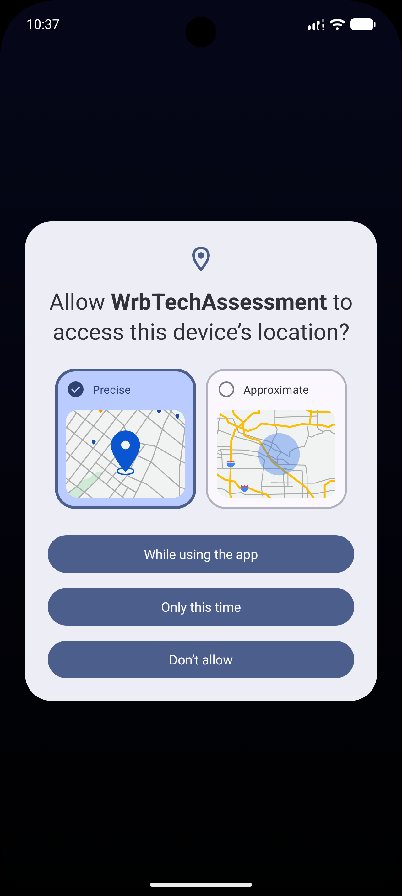
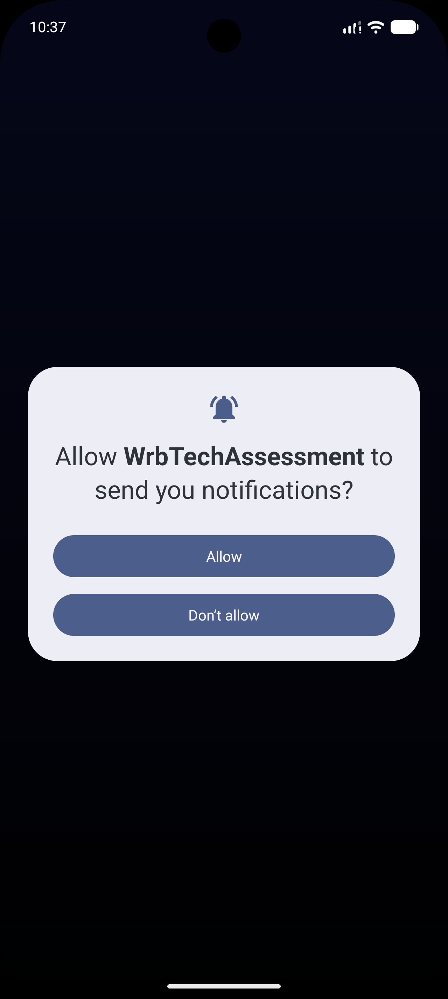
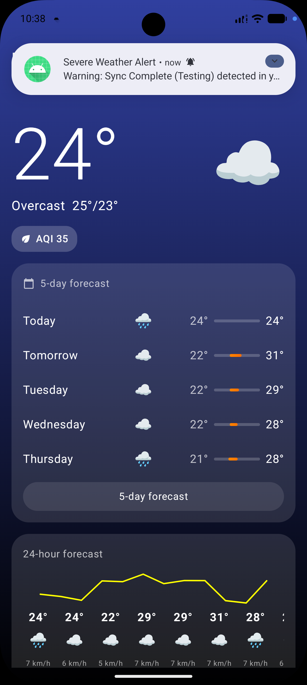
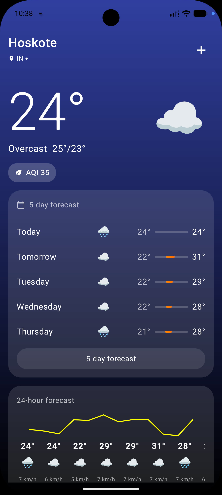
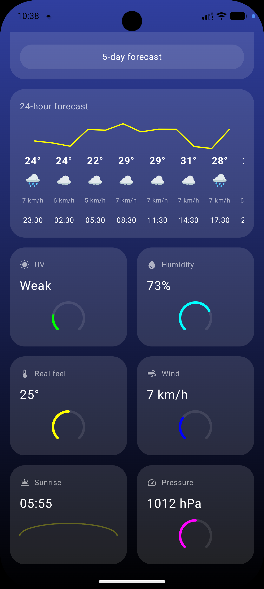
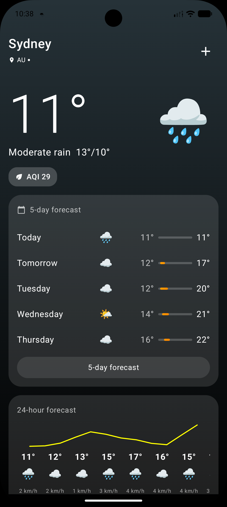
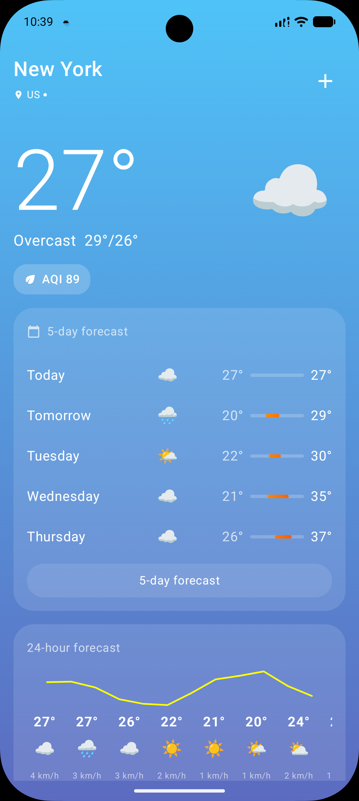
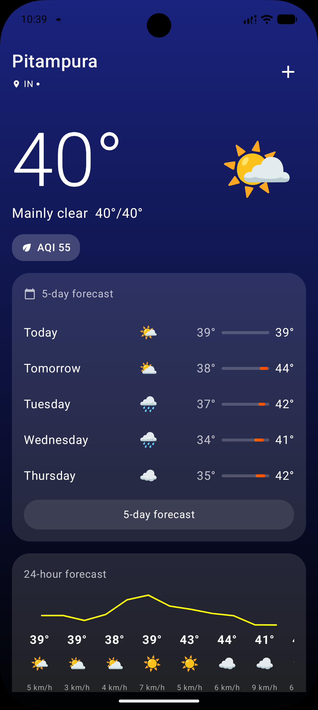
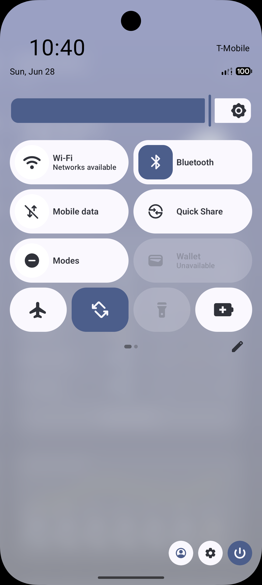

# WrbTechAssessment - Weather Application

A modern Android weather application built using **Jetpack Compose**, **Clean Architecture**, and **MVVM**. The app provides real-time weather updates, location-based weather tracking, background synchronization, and a manageable list of global cities.

## 📸 Screenshots

| Location Permission | Notification Permission | Background Alert | Main Dashboard |
|:---:|:---:|:---:|:---:|
|  |  |  |  |

|                 Main Dashboard (Details)                 | Manage Cities | Dashboard (Sydney) | Dashboard (New York) |
|:--------------------------------------------------------:|:---:|:---:|:---:|
|  |  |  |  |

| Dashboard (Pitampura) | Notification Tray |
|:---:|:---:|
|  |  |

## 📱 Features

- **Current Location Weather**: Automatically detects your location to show local weather.
- **Manage Cities**: A dedicated screen to view weather for major global cities (Sydney, Tokyo, London, etc.).
- **Offline First**: All weather data is cached in a local Room database for offline viewing.
- **Background Sync**: The app is scheduled to sync every **30 minutes** in the background using WorkManager (see `WeatherApp.kt`).
- **Weather Alerts**: Automatically sends a high-priority **Notification** if it detects severe conditions like **Heavy Rain**, **Heavy Thunderstorms**, or **Moderate Thunderstorms** during a background sync (see `WeatherSyncWorker.kt`).
- **Rich UI**: High-fidelity weather details including UV Index, Humidity, Air Quality, and Sun timings with custom Gauge visualizations.
- **Modern Navigation**: Uses the latest Navigation 3 framework for type-safe screen transitions.

---

## 🏗️ Architecture (HLD)

The project follows **Clean Architecture** principles, separating the code into three distinct layers:

### 1. Domain Layer
The core of the application. It is independent of any other layer and contains:
- **Models**: Plain Kotlin data classes (`WeatherInfo`, `WeatherData`).
- **Repositories (Interfaces)**: Definition of data operations.
- **Use Cases**: Encapsulates specific business logic (`GetWeatherUseCase`).

### 2. Data Layer
Handles all data operations and coordinates between multiple data sources:
- **Remote**: Retrofit interfaces for OpenWeather API and Google Geocoding API.
- **Local**: Room database for persistent caching.
- **Repository Implementation**: Coordinates cache-first logic and network fetches.
- **Mappers**: Converts DTOs to Domain models.

### 3. Presentation Layer
Follows the **MVVM (Model-View-ViewModel)** pattern:
- **UI (Jetpack Compose)**: Declarative UI components.
- **ViewModel**: Manages UI state using `StateFlow` and handles user interactions.
- **Navigation**: Centralized type-safe navigation using Navigation 3.

#### Why MVVM over MVI?
While MVI (Model-View-Intent) provides strict unidirectional data flow and state consistency, **MVVM** was chosen for this project for several strategic reasons:
- **Reduced Boilerplate**: MVVM avoids the verbose intent/action/reducer cycle required by MVI, making the codebase more maintainable for a project of this scale.
- **Lifecycle Management**: `ViewModel` with `StateFlow` naturally integrates with Jetpack Compose, providing a robust way to handle configuration changes without the complexity of a centralized state store.
- **Ease of Testing**: MVVM's separation of concerns allows for straightforward unit testing of business logic in the ViewModel without mocking complex intent streams.
- **Performance**: For a weather application where UI updates are frequent but granular (e.g., individual gauge animations), MVVM's state observation is highly efficient.
- **Project Scale**: MVI is typically best suited for large-scale enterprise applications with massive teams and extremely complex state interactions. For a focused utility application like this, the added overhead of MVI would provide diminishing returns compared to the speed and maintainability of MVVM.

---

## 🛠️ Technical Stack (LLD)

- **Language**: Kotlin (100%)
- **UI**: Jetpack Compose
- **Asynchronous**: Kotlin Coroutines & Flow
- **Dependency Injection**: Hilt (Dagger)
- **Networking**: Retrofit 2 & OkHttp
- **JSON Parsing**: Gson (with custom `WeatherType` adapters)
- **Local Database**: Room
- **Background Tasks**: WorkManager
- **Navigation**: Navigation 3
- **Testing**: JUnit, MockK, Turbine, Google Truth
- **Image Loading**: Coil (with GIF support)

### Key Design Patterns:
- **State Pattern**: UI reacts to a single `WeatherState` object.
- **Singleton Pattern**: Database and Network instances provided via Hilt.
- **Adapter Pattern**: Custom TypeAdapter for mapping weather codes to domain types.

---

## ⚙️ Setup & Installation

### 1. Prerequisites
- Android Studio Ladybug or newer.
- JDK 17+.

### 2. API Keys
The app requires two API keys. Create a `local.properties` file in the root directory:
```properties
OPENWEATHER_API_KEY=your_openweather_api_key_here
GOOGLE_MAPS_API_KEY=your_google_maps_api_key_here
```

### 3. Build
- Clone the repository.
- Sync Gradle.
- Run the `:app` module.

---

## 📝 Assumptions & Decisions

- **Google Places API**: The application originally intended to use the Google Places SDK for city autocomplete. However, due to the requirement for **active billing details** on Google Cloud to use the Places SDK, the feature was pivoted. Instead, a static list of major cities with verified coordinates is provided in the "Manage Cities" screen.
- **Cache-First Strategy**: The app prioritizes local data. If data is fresh (less than 30 minutes old), it skips the network call to save battery and data.
- **Notification Priority**: Background sync triggers high-priority notifications only for "Severe" weather types (Heavy Rain, Thunderstorms) as per common user preference.
- **Location Permissions**: The app gracefully handles cases where location permission is denied by showing a specific error state and allowing manual city selection.

---

## 🧪 Testing
The project includes unit tests for ViewModels and Repositories.
Run tests via CLI:
```bash
./gradlew test
```
View coverage report (Kover):
```bash
./gradlew :app:koverHtmlReport
```
Report location: `app/build/reports/kover/html/index.html`
